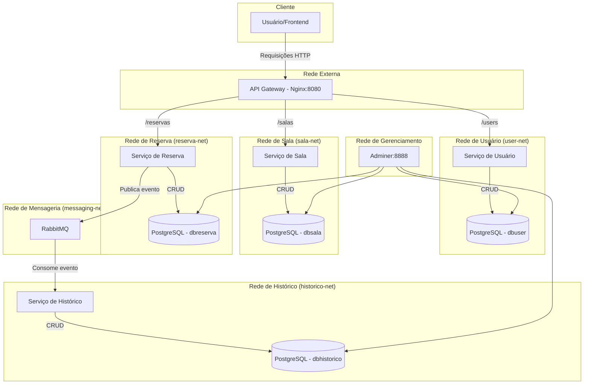

# Sistema de Reserva de Salas - Arquitetura de Microserviços

Este projeto implementa um sistema de reserva de salas utilizando uma arquitetura de microserviços. A aplicação é totalmente containerizada com Docker e orquestrada com Docker Compose.

## Visão Geral da Arquitetura

A arquitetura é composta por quatro microserviços principais, um API Gateway que centraliza o acesso, bancos de dados isolados para cada serviço e um sistema de mensageria para comunicação assíncrona.

- **API Gateway (Nginx)**: Ponto único de entrada para todas as requisições externas. Roteia as chamadas para o microserviço apropriado.
- **Microserviços (Spring Boot)**:
    - **Serviço de Usuário**: Gerencia os dados dos usuários.
    - **Serviço de Sala**: Gerencia as salas disponíveis para reserva.
    - **Serviço de Reserva**: Orquestra a criação de reservas, validando a disponibilidade.
    - **Serviço de Histórico**: Mantém um registro de todas as reservas concluídas, consumindo mensagens de forma assíncrona.
- **Bancos de Dados (PostgreSQL)**: Cada microserviço possui sua própria instância de banco de dados, garantindo o isolamento dos dados.
- **Mensageria (RabbitMQ)**: Utilizado para desacoplar os serviços. O serviço de reserva publica um evento quando uma reserva é feita, e o serviço de histórico consome esse evento para criar um registro.

### Diagrama da Arquitetura



## Tecnologias Utilizadas

- **Backend**: Java 17, Spring Boot 3
- **Banco de Dados**: PostgreSQL
- **Containerização**: Docker, Docker Compose
- **API Gateway**: Nginx
- **Mensageria**: RabbitMQ

## Pré-requisitos

- Docker
- Docker Compose

## Como Executar o Projeto

1.  Clone este repositório.
2.  Na pasta raiz do projeto, execute o seguinte comando para construir as imagens e iniciar todos os containers:
    ```sh
    docker compose up --build -d
    ```
3.  A aplicação estará disponível através do API Gateway na porta `8080`.

## Endpoints da API

Todas as requisições devem ser feitas para o API Gateway em `http://localhost:8080`.

- **Serviço de Usuário**:
  - `GET /users`
  - `POST /users`

- **Serviço de Sala**:
  - `GET /salas`
  - `POST /salas`

- **Serviço de Reserva**:
  - `GET /reservas`
  - `POST /reservas` (o corpo deve incluir `sala_id`, `usuario_id` e `nome_usuario`)

## Ferramentas de Gerenciamento

- **RabbitMQ Management**: Acesse a interface web do RabbitMQ para monitorar filas e mensagens em `http://localhost:15672`. (Login: `user` / Senha: `password`)
- **Adminer**: Acesse a ferramenta de gerenciamento de banco de dados em `http://localhost:8888` para visualizar os dados de cada serviço. Os nomes dos hosts dos bancos são `dbuser`, `dbsala`, `dbreserva`, e `dbhistorico`.

